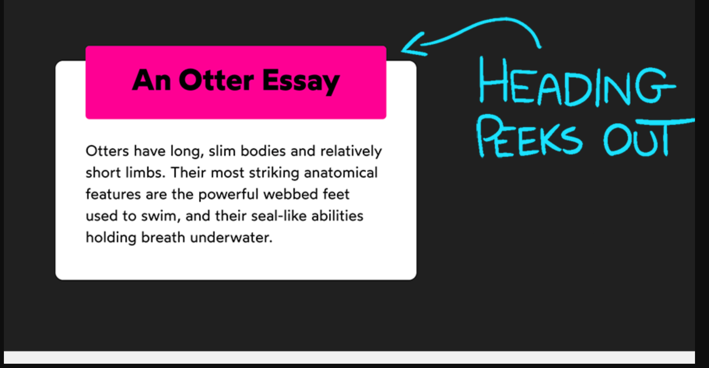

# CSS Hands-On Assignment - Exercise 1

# Description
Convert the design in the image (without the arrow and the ‘heading peeks out’ text) to HTML and CSS.


# How to clone the repo
```bash
https://github.com/ekundayoSO/altschool-css-502-1.git
```

# Author
```bash
. Sulaimon Ekundayo
```